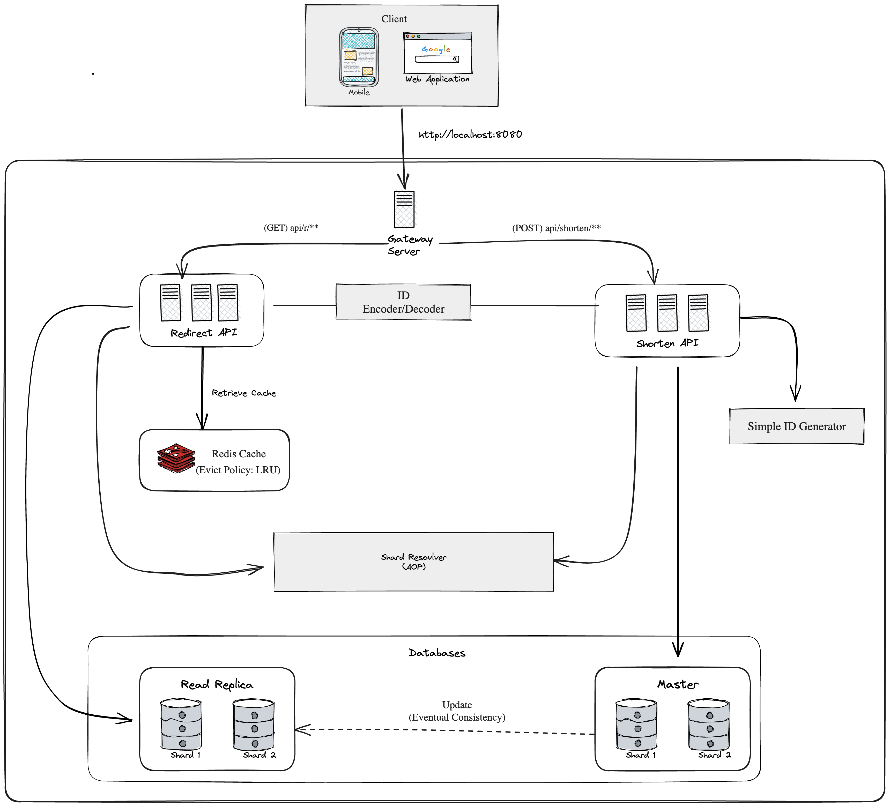

# System Design: Distributed URL Shortener

## 1. Overview

A distributed, read-optimized URL shortening system using Spring Boot microservices. Built to scale horizontally, support sharding, and handle high read throughput.

## 2. Architecture Diagram

## 3. Components

### 3.1 Gateway Server
- Routes requests to `/shorten/**` and `/r/**`
- Handles basic routing and rate limiting

### 3.2 Shorten API
- Accepts long URLs and generates short IDs
- Writes to sharded database and updates Redis

### 3.3 Redirect API
- High-read path for short URL resolution
- Redis-first, DB fallback
- Read-only DB access

### 3.4 ID Generator
- Generates unique short IDs using Base62 encoding
- **Scalable design**: In the future, this can be upgraded to use Snowflake or similar ID generation algorithms to ensure distributed uniqueness.
- Read more on this design decision here: [Why Distributed Systems Need Their Own Unique ID Generator](https://medium.com/@zell_dev/why-distributed-systems-need-their-own-unique-id-generator-38bd10bcbc97)

### 3.5 Common Service / Lib
- Shared models, utils, config, and shard resolvers

## 4. Data Flow

### Shortening Flow
1. Client sends `POST /shorten` with a long URL
2. Shorten API calls ID generator
3. Writes to DB and Redis

### Redirect Flow
1. Client hits `GET /r/{shortId}`
2. Redirect API checks Redis
3. If miss, fallback to DB

## 5. Database Sharding

- 2–3 Postgres shards simulated via Docker
- Shard selected using hash of short ID
- Shard resolver utility in common-service

## 6. Redis Caching

- Shortened URL mappings are cached
- LRU + TTL eviction strategy

## 7. Tech Stack

| Layer      | Technology           |
|------------|----------------------|
| API        | Spring Boot          |
| Gateway    | Spring Cloud Gateway |
| Caching    | Redis                |
| DB         | PostgreSQL (sharded) |
| Infra      | Docker / Compose     |
| Metrics    | Spring Actuator      |

## 8. Future Enhancements

- Add analytics 
- Custom aliases support
- Kafka-based event logging
- Frontend dashboard

## 9. Author

Ng Feng Long (Zell)  
🔗 https://withzell.com  
🐙 https://github.com/ngfenglong
